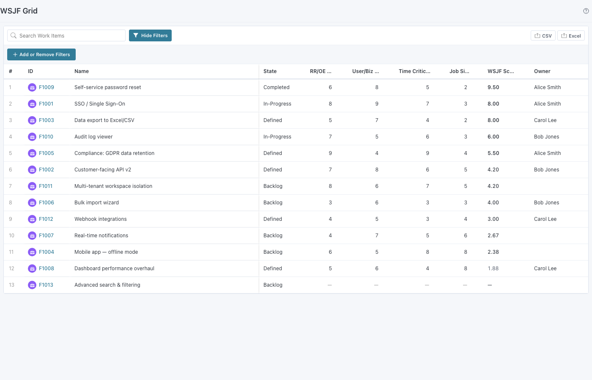

# WSJF Grid

A Rally Custom View widget that displays Portfolio Items ranked by their **Weighted Shortest Job First (WSJF)** score, with inline editing of all four WSJF input fields.




---

## What is WSJF?

Weighted Shortest Job First is a SAFe prioritization method that helps teams sequence work to maximize economic benefit. The formula:

> **WSJF Score = (RR/OE Value + User/Business Value + Time Criticality) / Job Size**

| Field | Rally Field | Description |
|-------|-------------|-------------|
| RR/OE Value | `RROEValue` | Risk Reduction / Opportunity Enablement |
| User/Business Value | `UserBusinessValue` | Direct user or business impact |
| Time Criticality | `TimeCriticality` | Cost of delay due to time sensitivity |
| Job Size | `JobSize` | Relative effort / size estimate |
| WSJF Score | `WSJFScore` | Calculated and saved to Rally |

Higher scores = higher priority.

---

## Features

- Grid of Portfolio Items sorted by WSJF Score (descending)
- **Inline editing** — click any WSJF input cell to edit; score recalculates instantly and both the input and score are saved to Rally
- Items with no Job Size show `—` in the score column (divide-by-zero safe)
- Export to CSV and Excel
- Settings: switch between Feature and Epic types, add a custom WSAPI filter

---

## Build Commands

```bash
npm run dev         # Dev server (mock data) at http://localhost:5848
npm run build       # Production IIFE bundle (live Rally data)
npm run build:mock  # Mock bundle (no Rally credentials needed)
npm run typecheck   # TypeScript check
```

Create `auth.json` in this directory for live Rally dev proxy:
```json
{ "server": "https://rally1.rallydev.com", "apiKey": "YOUR_KEY" }
```

---

## Settings

| Setting | Default | Description |
|---------|---------|-------------|
| Portfolio Item Type | Feature | Switch between Feature and Epic |
| Additional Filter | (none) | Extra WSAPI query, e.g. `(State = "In-Progress")` |

---

## Source

- `src/App.tsx` — Main widget component
- `src/types.ts` — `WsjfItem`, `WsjfDataProvider`, `WsjfSettings`, `calcWsjfScore`
- `src/data-provider.ts` — Live Rally WSAPI provider
- `src/mock-data.ts` — 13 mock Features for dev/demo
- `src/hooks/useWsjfData.ts` — Data fetching hook
- `src/main.tsx` — Entry point, mock/live branching

## Reference


- SAFe WSJF: [scaledagileframework.com/wsjf](https://scaledagileframework.com/wsjf/)
