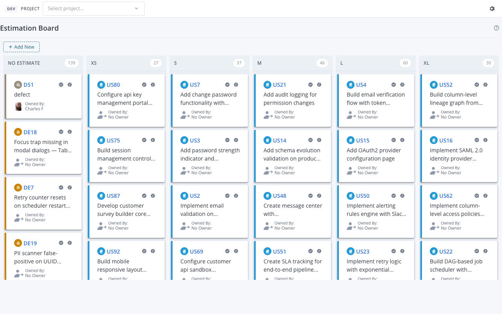
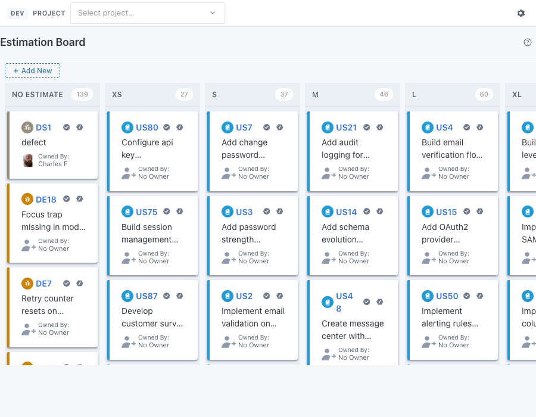
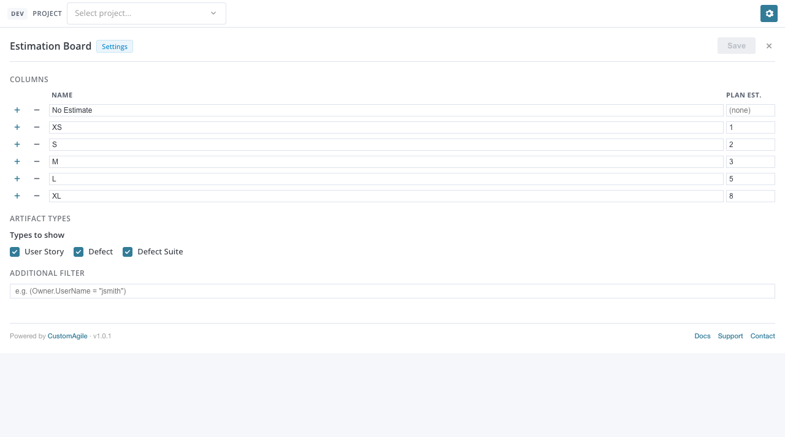
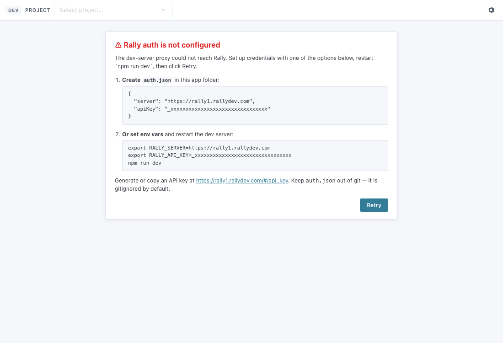
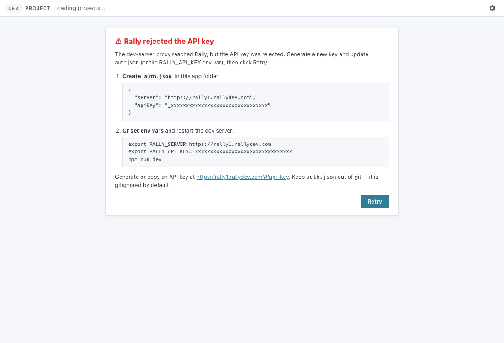

# Setup Guide

End-to-end setup for a `@customagile/widget-ai` widget — auth, dev harness,
auto-deploy. Works for new widgets created from the template and for
existing widgets that follow the same layout.

## Prerequisites

- Node 18+ and npm
- A Rally workspace and project you can access
- A Rally API key (instructions below)

## 1. Generate a Rally API key

1. Sign in to Rally.
2. Open the API key page: **<https://rally1.rallydev.com/#/api_key>** (or click your avatar → API Keys).
3. Click **Create**, give the key a name (e.g. `widget-dev`), pick the workspaces it can access, and copy the full key. It starts with `_` and is ~43 chars long.
4. Treat it like a password — don't paste it into anything that gets committed.

## 2. Configure auth (pick one)

The Vite dev server proxies `/slm/*` (WSAPI) and `/analytics/*` (LBAPI) to
Rally. It needs a server URL and an API key. You have two options — they
are read in this order, first non-empty wins:

### Option A — `auth.json` (per-widget, gitignored)

Create `auth.json` in the widget folder:

```json
{
  "server": "https://rally1.rallydev.com",
  "apiKey": "_xxxxxxxxxxxxxxxxxxxxxxxxxxxxxxxxxxxxxxxxxxxxx"
}
```

`auth.json` is in the root `.gitignore`, so it never gets committed. The
auto-deploy CLI (`widget-ai deploy`) also reads from this file.

### Option B — environment variables / `.env.local`

Set them in your shell:

```bash
export RALLY_SERVER=https://rally1.rallydev.com
export RALLY_API_KEY=_xxxxxxxxxxxxxxxxxxxxxxxxxxxxxxxxxxxxxxxxxxxxx
```

…or drop a gitignored `.env.local` in the widget folder (Vite picks it
up via `loadEnv`):

```dotenv
RALLY_SERVER=https://rally1.rallydev.com
RALLY_API_KEY=_xxxxxxxxxxxxxxxxxxxxxxxxxxxxxxxxxxxxxxxxxxxxx
```

`.env.local` matches the existing `*.local` rule in `.gitignore` — also
safe by default.

> **Restart `npm run dev` after changing either source.** Vite reads them
> at startup.

## 3. Run the dev server

```bash
npm run dev
```

The terminal prints a URL (default `http://localhost:5173`, or whatever
the launch script forces). Open it in any browser.

### What the DevHarness shows you

When you load the page from `localhost`, the SDK wraps your widget in
`<DevHarness>` automatically (see [`main.tsx`](../src/main.tsx)). It
renders a thin toolbar across the top of the page:



The toolbar is **never shown** outside `localhost` — in Rally and in
production builds the harness is a transparent pass-through.

The board content fits inside its columns at any width — open a narrow
window and cards wrap and clip cleanly:



#### Project picker

Choose the project you want the widget scoped to. The harness updates
`rallyContext.GlobalScope.Project`, and the next data fetch reflects the
new scope. The selection is remembered in `localStorage` per browser.

When **no project is selected**, no project parameter is sent to Rally
and the widget runs against your default project — the same behaviour
as when the Custom View is added to a personalized page in Rally.

#### Gear (settings)

Toggles `rallyContext.isEditMode`. The widget responds by rendering its
`<EditModePanel>` instead of the normal view, exactly like clicking
"Edit" on the Custom View in Rally. Click the gear again to return to
the board.



This is how you exercise widget settings without having to deploy and
edit the view inside Rally.

### Auth setup screen

If the dev server can't reach Rally, the harness replaces the widget
content with a setup card so the failure is unmissable.

**No credentials at all** (no `auth.json`, no env vars):



**Credentials present but rejected by Rally** (key revoked, expired, or
wrong workspace):



The card includes the same auth instructions as this guide. After you
add credentials, click **Retry** — the harness re-probes without a full
page reload.

## 4. Deploy to Rally

```bash
npx widget-ai deploy
```

What it does, in order:

1. Runs `vite build` — emits a single `dist/app.js` IIFE with all
   styles inlined.
2. Wraps it in a minimal HTML doc that loads React from a CDN.
3. Reads `rally.config.json` for the widget name and target workspace.
4. Reads `auth.json` for credentials (env vars are not currently used by
   the deploy CLI — only the dev-server proxy reads them).
5. Hits the WSAPI Custom HTML Widget catalog and either creates a new
   Custom View or updates the existing one in place.
6. Prints the Rally URL where the deployed widget can be opened.

The created/updated view ID is written back into `rally.config.json` so
subsequent deploys hit the same target.

> The deploy CLI requires `auth.json` (it does not read env vars). If
> you only want env-var auth for dev, you can keep `auth.json` for
> deploys only — both can coexist.

### Common deploy issues

- **`No auth.json found`** — create one (Option A above) before running
  `widget-ai deploy`.
- **`401 Unauthorized` from Rally** — API key is revoked or doesn't have
  access to the workspace. Generate a new one at the link in step 1.
- **`dist/app.js not found`** — build failed earlier in the pipeline;
  re-run `npm run build` and check the output.

## 5. Iterate

| Task                              | Command / action                               |
|-----------------------------------|------------------------------------------------|
| Edit a component                  | `src/App.tsx` — Vite hot-reloads on save       |
| Switch to a different project     | DevHarness → Project picker                    |
| Open the settings UI              | DevHarness → Gear button                       |
| Reset the persisted Rally context | Clear `localStorage` for `localhost`           |
| Production build                  | `npm run build`                                |
| Deploy to Rally                   | `npx widget-ai deploy`                         |
| Find the deployed Custom View     | URL printed at the end of `deploy`, also in `rally.config.json` |

---

## Reference

- [Getting Started](./getting-started.md) — quick orientation
- [API Reference](./api-reference.md) — every component and hook
- [Cookbook](./cookbook.md) — common patterns
